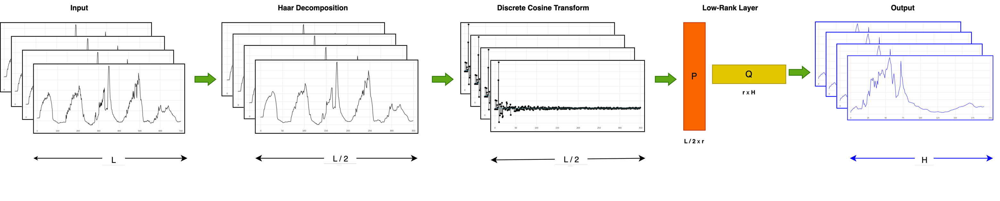

# HADL (Haar DCT Low-Rank) Framework

## Overview
HADL is a PyTorch-based framework for Long-Term Time Series Forecasting (LTSF), designed for noise robustness, efficiency, and accuracy. It integrates Discrete Wavelet Transform (DWT) with a Haar wavelet for noise reduction, Discrete Cosine Transform (DCT) for feature extraction, and a low-rank layer for efficient low parameterized forecasting.



## Key Features
- **Haar Wavelet (DWT)**: Reduces noise and compresses the input, enabling a lightweight model with fewer parameters.
- **Discrete Cosine Transform (DCT)**: Extracts meaningful long-term patterns.
- **Low-Rank Approximation**: improve generalization and noise robustness while minimizing memory usage. 
- **Lightweight Design**: A single prediction layer reduces overall complexity, ensuring that the model remains lightweight and interpretable

## Implementation
The framework processes input data by:
1. **DWT with Haar** – Removes noise and halves input length.
2. **DCT** – Extracts dominant patterns in the frequency domain.
3. **Low-Rank Prediction Layer** – Ensures generalization and efficiency.

## Components

### HADL class
Implmentation of HADL Class.
```python
class Model(nn.Module):
    def __init__(self, configs):
            super(Model, self).__init__()
            self.seq_len = configs.seq_len  # Input sequence length
            self.pred_len = configs.pred_len  # Prediction horizon
            self.channels = configs.enc_in  # Number of input channels (features)
            self.rank = configs.rank  # Rank for low-rank approximation
            self.bias = configs.bias  # Whether to include bias
            self.individual = configs.individual  # Use separate models per channel
            self.enable_Haar = configs.enable_Haar  # Enable Haar transformation
            self.enable_DCT = configs.enable_DCT  # Enable Discrete Cosine Transform
            self.enable_iDCT = configs.enable_iDCT  # Enable Inverse Discrete Cosine Transform
            self.enable_lowrank = configs.enable_lowrank  # Enable low-rank approximation
```

### Low Rank Class
Implementation of Low Rank Class.
```python
class LowRank(nn.Module):
    def __init__(self, in_features, out_features, rank, bias=True):
        super(LowRank, self).__init__()
        self.in_features = in_features
        self.out_features = out_features
        self.rank = rank
        self.bias = bias
```

## Usage

### Initialization
The model can be initialized with a configuration object that specifies various parameters such as sequence length, prediction length, number of channels, rank for low-rank approximation, and flags to enable/disable Haar, DCT, iDCT and low-rank.

```python
configs = {
    'seq_len': 512,
    'pred_len': 96,
    'enc_in': 7,
    'rank': 30,
    'bias': 1,
    'individual': 0,
    'enable_Haar': 1,
    'enable_DCT': 1,
    'enable_iDCT': 0,
    'enable_lowrank': 1
}

model = Model(configs)
```
### Configuration Options
| Parameter       | Description                                    | Default |
|---------------|--------------------------------|---------|
| `seq_len`     | Input sequence length                         | -       |
| `pred_len`    | Output prediction length                      | -       |
| `enc_in`    | Number of input features                      | -       |
| `rank`        | Rank of the low-rank layer                    | 30      |
| `individual`  | If True, applies a separate layer per feature | False   |
| `bias`        | Enables bias in the low-rank layer            | True    |
| `enable_Haar` | Enables Haar decomposition                    | True    |
| `enable_DCT`  | Enables Discrete Cosine Transform             | True    |
| `enable_iDCT`  | Enables Inverse Discrete Cosine Transform    | False    |
| `enable_lowrank`  | Enables Low Rank or Standard Linear Layer    | True    |

### Forward Pass
The forward method takes an input tensor of shape `[Batch, Input length, Channel]` and returns an output tensor of shape `[Batch, Output length, Channel]`.

```python
input_tensor = torch.randn(512, 96, 10)  # Example input
output_tensor = model(input_tensor)
```

## License
This project is licensed under the MIT License.
