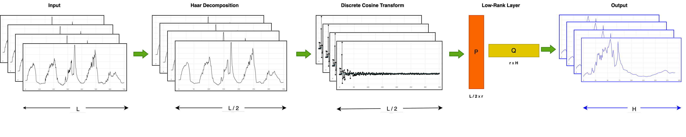
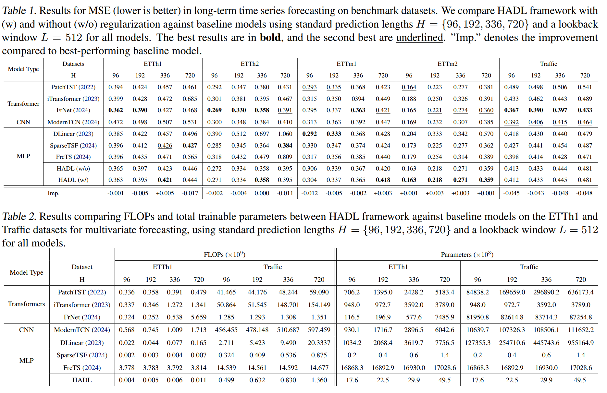

# HADL (Haar DCT Low-Rank) Framework for Noise Resilient Long Term Time Series Forecasting

## Overview
HADL is a lightweight, PyTorch-based framework for Long-Term Time Series Forecasting (LTSF), optimized for noise robustness, accuracy, and memory efficiency. It integrates Discrete Wavelet Transform (DWT) with a Haar wavelet for noise reduction, Discrete Cosine Transform (DCT) for enhanced feature extraction, and a low-rank layer for efficient, low-parameter forecasting. It is designed to achieve state-of-the-art multivariate forecasting accuracy with minimal trainable parameters, thus offers a computationally efficient solution for long-horizon time series prediction.



## Key Features
- **Haar Wavelet (DWT)**: Reduces noise and compresses the input, enabling a lightweight model with fewer parameters.
- **Discrete Cosine Transform (DCT)**: Extracts meaningful long-term patterns.
- **Low-Rank Approximation**: improve generalization and noise robustness while minimizing memory usage. 
- **Lightweight Design**: A single prediction layer reduces overall complexity, ensuring that the model remains lightweight and interpretable

## Usage

### Initialization
The model can be initialized with a configuration object that specifies various parameters such as sequence length, prediction length, number of channels, rank for low-rank approximation, and flags to enable/disable Haar, DCT, iDCT and low-rank.

```python
configs = {
    'seq_len': 512,
    'pred_len': 96,
    'enc_in': 7,
    'individual': False,
    'bias': True,
    'enable_Haar': True,
    'enable_DCT': True,
    'enable_iDCT': False,
    'enable_lowrank': True,
    'rank': 30,
}

model = Model(configs)
```
### Configuration Options
| Parameter       | Description                                    | Default |
|---------------|--------------------------------|---------|
| `seq_len`     | Input sequence length                         | -       |
| `pred_len`    | Output prediction length                      | -       |
| `enc_in`    | Number of input features                      | -       |
| `individual`  | If True, applies a separate layer per feature | False   |
| `bias`        | Enables bias in the low-rank layer            | True    |
| `enable_Haar` | Enables Haar decomposition                    | True    |
| `enable_DCT`  | Enables Discrete Cosine Transform             | True    |
| `enable_iDCT`  | Enables Inverse Discrete Cosine Transform    | False    |
| `enable_lowrank`  | Enables Low Rank or Standard Linear Layer    | True    |
| `rank`        | Rank of the low-rank layer                    | 30      |

### Forward Pass
The forward method takes an input tensor of shape `[Batch, Input length, Channel]` and returns an output tensor of shape `[Batch, Output length, Channel]`.

```python
input_tensor = torch.randn(512, 96, 10)  # Example input
output_tensor = model(input_tensor)
```

# Results



# Acknowledgement
The listed github repositories have been used for code bases, datasets and comparisons.

- https://github.com/zhouhaoyi/Informer2020
- https://github.com/lss-1138/SparseTSF
- https://github.com/cure-lab/LTSF-Linear
- https://github.com/aikunyi/FreTS
- https://github.com/luodhhh/ModernTCN
- https://github.com/yuqinie98/patchtst
- https://github.com/thuml/iTransformer
- https://github.com/SiriZhang45/FRNet


## License
This project is licensed under the MIT License.
